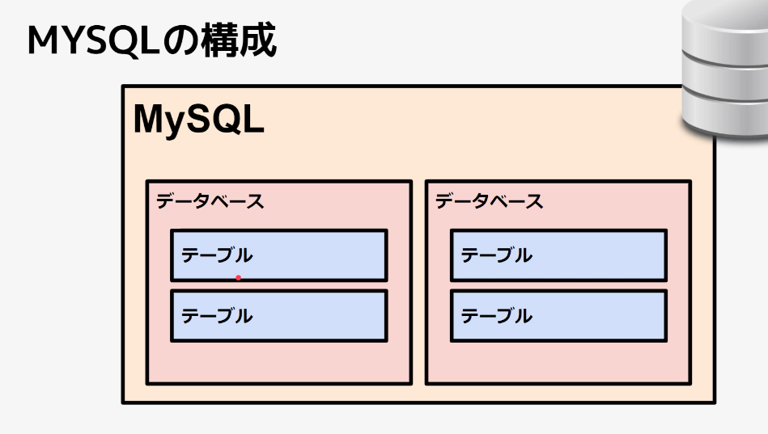

# DBの基本

## RDBMS

__R__ elational __D__ atabase __M__ anagement __S__ ystem

テーブルごとにデータを分けて保存・管理するデータ・ベースのシステムのこと。



|||
|:---:|---|
|テーブル|__テーブル__（エンティティ）|
|行|__レコード__|
|属性|__カラム__|
|値|__フィールド__|

## テーブルと主キー

`テーブル毎` に、`重複しない`・`変更しない`、レコードを一意に特定するキーを設定しなければならない。
これを `主キー（Primary Key）` と呼ぶ。

## 複数の主キー

店舗Aと店舗Bがありそれぞれに管理している商品がある。
以下のように、店舗が増えればDBの増えていく設計は __最悪__ である。

__店舗A__

|商品名|数量|
|:---|---:|
|タンス|1|
|椅子|2|

__店舗B__

|商品名|数量|
|:---|---:|
|タンス|10|
|椅子|5|

この場合、`複数の属性`でレコードを一意に特定する。
これを `複合主キー` という。

|商品ID|店舗名|商品名|数量|
|:---:|:---:|:---|---:|
|__001__|__店舗A__|タンス|1|
|__002__|__店舗A__|椅子|2|
|__001__|__店舗B__|タンス|10|
|__002__|__店舗B__|椅子|5|


## 主キーに相応しくないもの

店舗の名称は変わる可能性がある。
それはキーにできないので、店舗名にIDをふる。

|商品ID|店舗ID|店舗名|商品名|数量|
|:---:|:---:|:---|:---|---:|
|__001__|__01__|店舗A|タンス|1|
|__002__|__01__|店舗A|椅子|2|
|__001__|__02__|店舗B|タンス|10|
|__002__|__02__|店舗B|椅子|5|

## DBの切り出し

問題点として以下がある。

* 店舗名を変更するのが面倒。
* まだ在庫を持たない店舗C, D...があるかもしれない。
  
この問題を解決するために、店舗と商品の情報を分けてDBの切り出しを行う。

### 在庫テーブル
|商品ID|店舗ID|商品名|数量|
|:---:|:---:|:---|---:|
|__001__|__01__|タンス|1|
|__002__|__01__|椅子|2|
|__001__|__02__|タンス|10|
|__002__|__02__|椅子|5|

### 店舗テーブル
|店舗ID|店舗名|
|:---:|:---:|
|__001__|店舗A|
|__002__|店舗B|
|__003__|店舗C|
|__004__|店舗D|

## 外部キー

分けたテーブルをつなぐ必要がある。
その際に`外部キー（Foreing Key）`を使う。
他のテーブルと結合させるために使用する `キー`。

例では、突き合わせることができる `店舗ID` が `外部キー` にあたる。
外部キーによって付き合わした結果、一位のデータができる。

そういう意味で、まだテーブルを分割する必要がある。
商品名を分けてみる。

### 商品数量テーブル
|商品ID|店舗ID|数量|
|:---:|:---:|---:|
|__001__|__01__|1|
|__002__|__01__|2|
|__001__|__02__|10|
|__002__|__02__|5|

### 商品名テーブル
|商品ID|商品名|
|:---:|:---:|
|__001__|タンス|
|__002__|椅子|

### 店舗テーブル
|店舗ID|店舗名|
|:---:|:---:|
|__001__|店舗A|
|__002__|店舗B|
|__003__|店舗C|
|__004__|店舗D|

店舗の所在地（都道府県）の情報が必要になった場合、店舗テーブルに紐づいたテーブルを新たに一つ作る必要がある。

### 店舗テーブル
|店舗ID|店舗名|都道府県ID（FK）|
|:---:|:---:|:---:|
|__001__|店舗A|01|
|__002__|店舗B|02|
|__003__|店舗C|03|
|__004__|店舗D|04|

### 都道府県テーブル
|ID|都道府県|
|:---:|:---:|
|__01__|東京|
|__02__|大阪|
|__03__|福岡|
|__04__|札幌|

この程度まではやらないとDB設計ではないらしい。

## 正規化の手順

何も正規化を行なっていない状態を __非正規形__ という。
下の例では、店舗Aと東京がそれぞれマージされている状態。
つまり、行と列のデータが1：1とならない状態。

|店舗名|都道府県|商品名|数量|
|:---|:---:|:---|---:|
|店舗A|東京|タンス|10|
|||椅子|5

### 第一正規化

* データを`一行一行`にして分ける。
* __レコード__を一意に特定する`主キーを選定`する。
（__レコードだよ、一行分のデータのことだよ。__）

|_店舗ID_|店舗名|都道府県ID|都道府県名|_商品ID_|商品名|数量|
|:---:|:---:|:---:|:---:|:---:|:---|---:|
|001|店舗A|01|東京|0001|タンス|10|
|001|店舗A|01|東京|0002|椅子|5|

主キーを決める。今回は、`店舗ID`、`商品ID`

この状態を `第一正規形` という。

### 第二正規化

一部の主キーに従属している属性を別のテーブルに分ける。

|_店舗ID_|店舗名|都道府県ID|都道府県名|_商品ID_|商品名|数量|
|:---:|:---:|:---:|:---:|:---:|:---|---:|
|001|店舗A|01|東京|0001|タンス|10|
|001|店舗A|01|東京|0002|椅子|5|

この例でいくと、店舗IDが決まれば店舗名、都道府県ID、都道府県名は紐づいて抽出できる。
この関係を `部分関数従属` という。
そして、部分関数従属を取り除く処理を行うことを `第二正規化` という。

数量について考えると、数量は、店舗IDと商品IDによって特定される。この場合だと2つある主キーの両方に特定される属性を `完全関数従属` という。

|属性名|内容|例|
|:---|:---|:---|
|__部分関数従属__|店舗ID、商品IDの __どちらか一方の属性__ によって特定される属性|店舗名、商品名など
|__完全関数従属__|店舗ID、商品IDの __両方の属性__ によって特定される属性|数量

#### 部分関数属性での括り
|店舗ID|店舗名|都道府県ID|都道府県名|
|:---:|:---:|:---:|:---:|
|001|店舗A|01|東京|
|001|店舗A|01|東京|

|商品ID|商品名|
|:---:|:---|
|0001|タンス|10|
|0002|椅子|5|

#### 完全関数属性での括り

両方のIDが必要なので取り除く必要がない。
反対に言えば、どちらか一方の属性がなければ成立しない『値』。

|店舗ID|商品ID|数量|
|:---:|:---|---:|
|001|0001|10|
|001|0002|5|

### 第三正規化

#### 推移的関数従属

主キー以外の属性に従属している属性を別テーブルに分ける。
この場合だと都道府県IDとなる。都道府県IDは主キーではない。

|属性名|内容|例|
|:---|:---|:---|
|__推移的関数従属__|主キー以外の属性に関数従属している属性|都道府県名は都道府県IDに従属|

|都道府県ID|都道府県名|
|:---:|:---:|
|01|東京|

#### 部分関数属性

|店舗ID|店舗名|都道府県ID
|:---:|:---:|:---:|
|001|店舗A|01|

|商品ID|商品名|
|:---:|:---|
|0001|タンス|
|0002|椅子|

#### 完全関数属性

|店舗ID|商品ID|数量|
|:---:|:---|---:|
|001|0001|10|
|001|0002|5|

一般的にはここまでで正規化は終わる。

## ER図

## SQL

### ステートメント

DBに対する命令。クエリと呼ばれることもある。

### 種類

* DDL
  * データ定義言語
  * Data Definition Language
  * DBオブジェクトの定義に使用する。
    * 例）
      * テーブル
      * インデックス
      * ファンクション
      * トリガー　etc
* DML
  * データ操作言語
  * Data Maniqulation Language
  * テーブルデータの操作に使用
    * データの取得、更新、削除、挿入


  
### データ定義言語　DDL

#### 命令の実行

命令の行にカーソルを置いて `control + return`


#### 複数の命令を実行

複数行選択して `option + x`

#### テーブルの作成

```sql
create table テーブル名 (
  カラム名 データ型 defalult デフォルト値 制約 comment 'コメント', ..., 表制約
) ENGINE = [INNODB | MyISAM];
```

データベースの種類（省略可）
`ENGINE = [INNODB | MyISAM]`
__データベースの種類__ はMySQLを使っていると宣言しいている。

__データ型__

|データ型|内容|
|:---|:---|
|INT|整数値|
|FLOAT|浮動小数点<br />※正の値に限定する場合は unsigned を使用。|
|DATETIME|日時|
|TIMESTAMP|日時|
|CHAR|固定長文字列|
|VARCHAR|可変長文字列|
|BLOB|バイナリデータ（画像や音声、動画など）|

|制約|内容|
|:---|:---|
|UNIQUE|一意制約|
|NOT NULL|NOT NULL制約|
|CHECK|チェック制約|
|PRIMARY KEY|主キー制約|
|FOREIGN KEY|外部キー制約|


#### 書いてみる

__データベースの作成__

```sql
create database test_db;
```

__データベースの削除__

```sql
drop database test_db;
```

__テーブルの作成__

作成の条件は、
* 『キー』はid
  * 『0以上』の整数
  * 『最初は』0が入っていて
  * コメントには『ID』と入れておく。

* 『キー』はval
  * 『文字制限』は20文字
  * 『最初は』helloが入っていて
  * コメントには『値』と入れておく。

```sql
create table test_db.test_table (
	id int(6) unsigned default 0 comment 'ID',
	val varchar(20) default 'hello' comment '値'
);
```
---
`create table test_db.test_table`
どのデータベースに任意のテーブルを作成するかを明示する
---
> カラムを設定、`id`属性

> 値は、`int unsigned` => `正の値の整数値`
> 6桁を指定（指定しないと10桁がデフォルトになっている）

> `ID`に値が挿入されなかった時の`デフォルト値`は`0`
---
> カラムを設定、`var`属性

> 値は、`可変長文字列`
> 長さは20文字

> `ID`に値が挿入されなかった時の`デフォルト値`は`hello`
---

__テーブルの削除__

```sql
drop table test_db.test_table;
```

__describe（記述する）__

DBeaver（コンソール）でデータベースを表組みになっている状態で確認する。

```sql
-- テーブルをデフォルトで出力。
desc test_db.test_table;
-- commentありで出力
show full columns from test_db.test_table;
```

```
-- 現時点でのクエリの内容を出力する。
show create table test_db.test_table;

結果をコピーペーストでエディタに持ってくると。。。
設定してない項目に関しては、デフォルトが置かれる。
この部分、『ENGINE=InnoDB DEFAULT CHARSET=utf8』

=>
CREATE TABLE `test_table` (
  `id` int(6) unsigned DEFAULT '0' COMMENT 'ID',
  `val` varchar(20) DEFAULT 'hello' COMMENT '値'
) ENGINE=InnoDB DEFAULT CHARSET=utf8
```

#### アクティブなDBの切り替え

`useキーワード`を使って`アクティブ`なDBを設定できる。

`test_db.test_table`と記述していたものが前をDBを省略して、
`test_table`とかける。

また、現在実行中のDBを確認するには、

`select database();`

__ここまでのまとめ__

```sql
-- DB作成。
create database test_db;
-- DB削除。
drop database test_db;
-- アクティブなDBの切り替え。
use test_db;
-- テーブルを作成する。
create table test_table (
	id int(6) unsigned default 0 comment 'ID',
	val varchar(20) default 'hello' comment '値'
);
-- テーブルを削除する。
drop table test_table ;
-- テーブルの詳細を記述する。
desc test_table ;
-- columns付きでテーブルの詳細を記述する。
show full columns from test_table ;
-- 現時点でのクエリの内容が出力される。
show create table test_table ;
-- 現在実行中のデータベースの確認。
select databese() ;
```

#### use

```
use test_db;
```

これを実行するとそのデータベースのスコープの中で作業をするイメージ。

* そして、テーブルを生成する際には`test_db.[table-name]`の記述をしていたが、以下のようにテーブル名を省略できる。

```
create table next_table (
	id int(2) unsigned default 0 comment 'ID',
	val varchar(200) default 'next table' comment 'defalut comment!!!'
);
```

* なお、現在使用しているテーブルの確認は、

```
select DATABASE();
```

#### 制約（CONSTANT）

制約は、カラム・テーブルに対して行う。
制約を与えることで、カラム・テーブルの状態を正しい状態に保つことができる。

__制約の種類と内容__
|名称|内容|
|---|---|
|UNIQUE|__一意制約__<br />カラムに制約をかけた場合、登録される値は必ず一意であることを担保する。|
|NOT NULL|__NOT NULL__<br />制約カラムに登録される値には必ず値があることを担保する|
|PRIMARY KEY|__主キー制約__|
|FOREIGN KEY|__外部キー制約__|
|CHECK|__チェック制約 (MySQL8.0)__<br /><small>※実装で使う機会はない。</small>|


* __表制約__
  * 表（テーブル）に対して行う制約
    例）複合主キー、外部キー制約など

* __列制約__
  * 列に対して行う制約
    例）NOT NULL 制約など


__書式__

```sql
create table テーブル名 (
    カラム名 データ型 列制約, 表制約
);
```

* `not null`の制約をかけたので、`Null`の欄が『Nullが入ってはいけない。』という意味で『NO』が入る。
* `unique`と制約をかけたので、`Key`の欄が『UNI』となり、一意であることを担保している。
```sql
create table test_table (
	id int not null default 0 comment 'ID',
	val varchar(20) unique comment '値'
)

use test_db;
show full columns from test_table ;
```

#### 主キーの作成（PK: Primary Key）

__主キー__（__レコードを一位に特定するキー__）を作成する。

* 特徴
  * __重複しない__
  * __変更しない__


|商品ID|商品名|数量|
|:---:|:---|---:|
|__001__|タンス|10|
|__002__|椅子|5|
|__003__|テーブル|20|
|__004__|タンス|100|

__主キーが一つの場合__

```sql
-- 一旦テーブルを削除する。
drop table test_table ;
-- PK有りのテーブルを作成する。
create table test_table (
	key1 int primary key
);
show full columns from test_table;

-- KeyがPRIになっており、プライマリー・キーに設定されたことを示している。
-- 何も制約を指示しなくても、not null, uniqueはついている。
```

__複合主キーを設定__
```sql
-- 複数のキーで値を特定できればいいので、ユニークである必要はない。
-- Nullになっていなければいい。
create table item_table(
	pid int,
	name varchar(10),
	primary key(pid, name)
);
```

#### 自動IDの付与（AUTO INC）

Key_nameがPRIMAEYになっていたらOK

auto incrementは1つのテーブルにつき1つだけ。
デフォルト値をわざわざ指定する必要はないので、デフォルト値はつけられない。

__自動IDを付与する__

主キーは一意の値であればなんでもいい場合に付与する。

`auto_increment`を設定する場合にインデックスが振られるようにしないといけない。
`primary key` または `unique`をつけることでインデックスが振られるようにできる。

```sql
create table test_table (
	key1 int auto_increment primary key
)
```

テーブルを確認する。
```sql
show full columns from test_table ;
または、
desc test_table ;
```

インデックスが振られるようになっているかを確認する。
`Key_name`が`PRIMAEY`になっていれば設定OK。
```sql
show index from test_table;
```

* 1つのテーブルで2つプラマリーキーは設定できない。
* defaultは設定できない。


#### テーブル定義の変更（ALTER TABLE）

__名前と年齢のカラムを追加する。__

```sql
alter table test_table 
add column name varchar(20) not null default '髙廣信之' comment '氏名',
add column age int(11) not null default 59 comment '年齢';
```

__任意のカラムの後ろに新規でカラムを追加する。__

```sql
alter table test_table 
add column gender varchar(10) not null default '男' comment '性別' after name;
```

__カラムの最初に追加する。__

```sql
alter table test_table 
add column country varchar(20) not null default '日本' comment '日本' first;
```

__カラムの属性を変更する。__
カラムの情報を変更すると元のものは削除されて新たに設定された値だけになる。
例えば、varchar(20) だったのを　text(100)だけだとそれ以降にせってしたあった情報は全てなくなる。

```sql
alter table test_table 
modify column gender varchar(10) not null default 'man' comment 'gender';
```

__カラムを削除する__。
```sql
ALTER table test_table 
drop column country;
```

__primary keyを削除する。__
auto incrementを削除してからではないとエラーになる。
エラーが出たらChatGPTで調べる。解決してくれる。

```sql
ALTER table test_table 
modify column key1 int(11) not null,
drop primary key;
```

#### テーブルを作成

```sql
create table shops (
id int(10) unsigned auto_increment primary key,
name varchar(20) not null,
pref_id int(2) unsigned not null);
```

複合主キーがある場合。
```sql
create table stoks (
product_id int(10) unsigned,
shop_id int(10) unsigned,
amount int(10) unsigned not null,
primary key (product_id, shop_id)
);
```

primary_keyした時点でnot_nullつくよ。


/*
外部キーの作成
see https://dev.mysql.com/doc/refman/5.6/ja/create-table-foreign-keys.html

注意）
- 型情報は合わせる
- インデックスの自動付与
（すでに有効なキーが存在する場合には作成しない。
　例：複合主キーの一番最初はインデックスが作成されない。）

ON DELETE: レコードが削除された際のアクション
ON UPDATE: レコードが更新された際のアクション

CASCADE:
親テーブルの行を削除または更新し、子テーブル内の一致する行を自動的に削除または更新します。

RESTRICT:
親テーブルに対する削除または更新操作を拒否します。
ON DELETE または ON UPDATE 句を省略することと同義。
*/

-- 外部キーの作成
alter table テーブル名
add constraint 制約名（※削除する際に使用）
foreign key (対象のキー名)
      references 親テーブル名(テーブルキー名)
      on update cascade 
      on delete restrict; -- 省略可

alter table shops
add constraint fk_pref_id
  foreign key(pref_id)
  references prefs (id)
  on update cascade

alter table stocks
add constraint fk_product_id
  foreign key(product_id)
  references products (id)
  on update cascade,
add constraint fk_shop_id
  foreign key(shop_id)
  references shops (id)
  on update cascade;

-- 外部キーの削除
alter table テーブル名
    drop foreign key 制約名;

-- 外部キーの確認
show create table stocks;